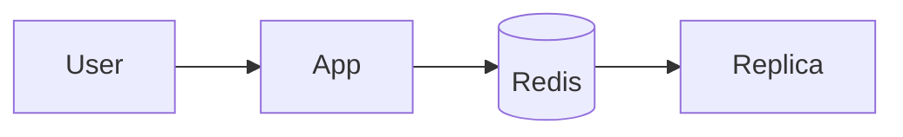
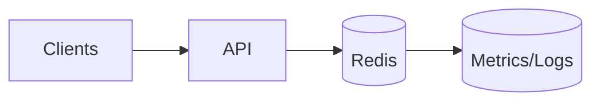
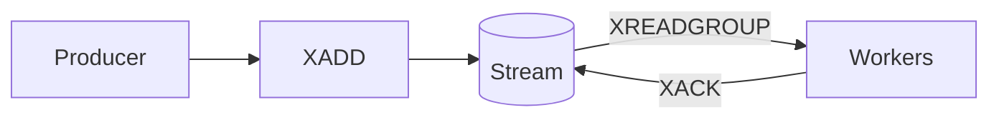
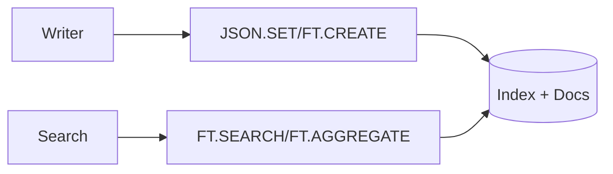

````markdown
# Redis Use‑Cases (Core & Stack/Redis 8 Capabilities): An Exhaustive, Command‑Level Guide

> **Note on versions and deprecations (Sept 21, 2025):** Redis 8 integrated previously “Redis Stack” capabilities (Search & Query, JSON, Time Series, Bloom/CF/TopK/CMS, and the new **Vectors** data type) into Redis Open Source; module repos note this integration for Bloom and TimeSeries, while Redis docs list these capabilities and V* vector commands in the command set, so this report treats them as first‑class features where applicable [Docs home](https://redis.io/docs/latest/), [Vectors data type](https://redis.io/docs/latest/develop/data-types/vectors/), [RedisBloom repo note](https://github.com/RedisBloom/RedisBloom), [RedisTimeSeries repo note](https://github.com/RedisTimeSeries/RedisTimeSeries).  
> **Archived/EOL:** **RedisGraph** is end‑of‑life; Redis removed graph capabilities from newer Stack builds and concluded support on **Jan 31, 2025** [RedisGraph EOL announcement](https://redis.io/blog/redisgraph-eol/), [Deprecated features notice](https://redis.io/docs/latest/operate/oss_and_stack/stack-with-enterprise/deprecated-features/graph/), [7.4.6 notes confirming EOL date](https://redis.io/docs/latest/operate/rs/release-notes/rs-7-4-2-releases/rs-7-4-6-268/).

---

## Executive Summary

Redis is an in‑memory data system offering single‑digit millisecond to sub‑millisecond operations over diverse data types (strings, hashes, sets, sorted sets, streams, time series, probabilistic structures, JSON documents, vectors, and a search/query engine) with optional persistence and high availability via replication and clustering across **16,384** hash slots [Scale with Redis Cluster](https://redis.io/docs/latest/operate/oss_and_stack/management/scaling/), [Cluster KEYSLOT](https://redis.io/docs/latest/commands/cluster-keyslot/).  
Core strengths include ultra‑low latency; atomic primitives; server‑side scripting/functions; powerful indexing/search (FT.\*); and now **native vector similarity search** via Query Engine and the **Vectors** data type, all while supporting durability (RDB, AOF, or both) and tunable consistency with **WAIT/WAITAOF** [Redis persistence overview](https://redis.io/docs/latest/operate/oss_and_stack/management/persistence/), [WAIT](https://redis.io/docs/latest/commands/wait/), [WAITAOF](https://redis.io/docs/latest/commands/waitaof/).  
This report systematizes Redis use‑cases with command‑level guidance, performance/ops, security, cost, migration patterns, and a comprehensive command reference, prioritizing official docs and noting deprecations and version dependencies where relevant [Docs home](https://redis.io/docs/latest/).

---

## Methodology & Sources Used

We used structured **web search** focused on **official Redis documentation** for command semantics, persistence, clustering, ACL/TLS, and module capabilities; reputable secondary sources (cloud docs, engineering blogs) enrich patterns and trade‑offs; tertiary items appear only when adding unique context without contradicting primary sources [Docs home](https://redis.io/docs/latest/), [Command reference index](https://redis.io/docs/latest/commands/command-docs/).  
Primary categories: command docs (EXPIRE/GET/SET/FT.\*/JSON.\*/TS.\*/BF.\*/CF.\*/TOPK.\*/CMS.\*/TDIGEST.\*/X\*/PUBSUB), clustering and hash‑slot behavior, persistence & replication, security (ACL/TLS/protected‑mode), and deprecations (Graph EOL) [TTL/EXPIRE](https://redis.io/docs/latest/commands/expire/), [FT.CREATE](https://redis.io/docs/latest/commands/ft.create/), [JSON docs](https://redis.io/docs/latest/develop/data-types/json/), [TimeSeries](https://redis.io/docs/latest/develop/data-types/timeseries/), [Bloom/CF/TOPK/CMS/TDIGEST](https://redis.io/docs/latest/develop/data-types/probabilistic/), [Streams](https://redis.io/docs/latest/develop/data-types/streams/), [Pub/Sub](https://redis.io/docs/latest/develop/pubsub/), [Cluster spec](https://redis.io/docs/latest/operate/oss_and_stack/reference/cluster-spec/), [Security/ACL](https://redis.io/docs/latest/operate/oss_and_stack/management/security/acl/), [TLS](https://redis.io/docs/latest/operate/oss_and_stack/management/security/encryption/), [Graph EOL](https://redis.io/blog/redisgraph-eol/).

---

## Use‑Case Portfolio (Deep Dives)

> **Implementation Snippet Conventions:** Python uses **redis‑py** [redis‑py guide](https://redis.io/docs/latest/develop/clients/redis-py/). Node.js uses **node‑redis v5** (RESP3‑capable) [node‑redis guide](https://redis.io/docs/latest/develop/clients/nodejs/), [node‑redis v5 RESP3](https://github.com/redis/node-redis/blob/master/docs/v5.md).  
> Snippets are minimal and align with official command semantics (atomicity/complexities per command pages) [Command reference index](https://redis.io/docs/latest/commands/command-docs/).

---

### 1) Caching (Read‑through/Write‑through/Write‑back; TTL/Eviction; Hot‑key Mitigation)

**Problem & Fit.** Redis excels as a cache via TTL/expiration, multiple eviction policies, and atomic primitives for stampede protection (e.g., `SET NX EX`). Use `maxmemory` and a specific **eviction policy** (e.g., allkeys‑LRU, volatile‑TTL) to bound memory, and adjust TTLs using `GETEX` for sliding expiries [EXPIRE/TTL](https://redis.io/docs/latest/commands/expire/), [GETEX](https://redis.io/docs/latest/commands/getex/), [Maxmemory & policies](https://github.com/redis/redis-doc/blob/master/docs/reference/eviction.md).  

**Reference Architecture (Mermaid).**  
```mermaid
flowchart LR
A[App(s)] -- GET / SET NX EX --> R[(Redis)]
subgraph Redis
R1[Primary]:::r --> R2[(Replica(s))]:::r
end
A -. fallback/load DB .-> DB[(Origin DB)]
R -- Keyspace invalidation/TTL --> A
classDef r fill:#f5f5f5,stroke:#c00,stroke-width:1px;
````

**Data Modeling.** Use namespacing (e.g., `cache:{tenant}:{resource}:{id}`) with **hash tags** (`{...}`) when multi‑key ops must co‑locate in the same hash slot in Cluster; otherwise omit tags for uniform distribution [CLUSTER KEYSLOT + hashtags](https://redis.io/docs/latest/commands/cluster-keyslot/), [Cluster scaling/hash slots](https://redis.io/docs/latest/operate/oss_and_stack/management/scaling/).

**Commands & Options.**

| Command                                     | Purpose                      | Key Args                | Complexity | Persistence/Replication Notes                         | Docs                                                                                           |
| ------------------------------------------- | ---------------------------- | ----------------------- | ---------- | ----------------------------------------------------- | ---------------------------------------------------------------------------------------------- |
| `GET`                                       | Read cache                   | key                     | O(1)       | Replicates; subject to eviction on memory pressure    | [GET](https://redis.io/docs/latest/commands/get/)                                              |
| `SET`                                       | Write; supports NX/XX, EX/PX | `NX`, `EX t`, `KEEPTTL` | O(1)       | AOF/RDB capture writes; use `NX` for stampede control | [SET](https://redis.io/docs/latest/commands/set/)                                              |
| `GETEX`                                     | Get + set TTL                | `EX t`/`PX`/`PERSIST`   | O(1)       | Adjusts expiration atomically                         | [GETEX](https://redis.io/docs/latest/commands/getex/)                                          |
| `TTL/PTTL`                                  | Time‑to‑live                 | key                     | O(1)       | Observability of expiry                               | [TTL](https://redis.io/docs/latest/commands/ttl/)                                              |
| `MEMORY USAGE`                              | Size estimate                | key                     | O(1)       | Capacity planning                                     | [MEMORY USAGE](https://redis.io/docs/latest/commands/memory-usage/)                            |
| `CONFIG SET maxmemory` / `maxmemory-policy` | Limit & policy               | bytes / policy          | O(1)       | Enforces eviction strategy                            | [Eviction policies](https://github.com/redis/redis-doc/blob/master/docs/reference/eviction.md) |

**Sample Implementations.**

*Python (read‑through with stampede control)*

```python
import redis, json, time
r = redis.Redis(decode_responses=True)
key = "cache:{user}:profile:{42}"
val = r.get(key)
if val is None:
    if r.set(key+":lock", "1", nx=True, ex=30):  # SET NX EX
        try:
            data = {"id":42,"name":"Ada"}  # fetch origin
            r.set(key, json.dumps(data), ex=300)
            val = json.dumps(data)
        finally:
            r.delete(key+":lock")
    else:
        time.sleep(0.05); val = r.get(key)
print(val)
```

[redis‑py guide](https://redis.io/docs/latest/develop/clients/redis-py/), [SET with NX/EX](https://redis.io/docs/latest/commands/set/).

*Node.js (write‑through with sliding TTL via GETEX)*

```js
import { createClient } from 'redis';
const client = createClient(); await client.connect();
const key = 'cache:{user}:profile:{42}';
let v = await client.get(key);
if (!v) {
  const data = JSON.stringify({ id: 42, name: 'Ada' });
  await client.set(key, data, { EX: 300 }); // write-through
  v = data;
} else {
  v = await client.getEx(key, { EX: 300 }); // slide TTL
}
console.log(v);
```

[node‑redis guide](https://redis.io/docs/latest/develop/clients/nodejs/), [GETEX](https://redis.io/docs/latest/commands/getex/).

**Operational Considerations.** Use replicas for read scale; enable Cluster for horizontal scale; prefer pipelining for batch warmups; pick eviction policy to avoid OOM; instrument `SLOWLOG` and `LATENCY` [Scale with Cluster](https://redis.io/docs/latest/operate/oss_and_stack/management/scaling/), [SLOWLOG](https://redis.io/docs/latest/commands/slowlog/), [LATENCY commands](https://redis.io/docs/latest/commands/latency/).

**Performance Tuning.** Pipeline `MGET`/`SET` batches; avoid large values; consider compression at app layer; use RESP3‑capable clients where helpful [Pipelining doc](https://redis.io/docs/latest/develop/use/pipelining/), [RESP3 in node‑redis v5](https://github.com/redis/node-redis/blob/master/docs/v5.md).

**Security.** Require TLS in transit (`tls-port`, disable non‑TLS `port`), and ACL users with least privilege [TLS config](https://redis.io/docs/latest/operate/oss_and_stack/management/security/encryption/), [ACL SETUSER](https://redis.io/docs/latest/commands/acl-setuser/).

**Testing & Observability.** Set SLOs on `latency`/`errors`; use `SLOWLOG GET` and `LATENCY DOCTOR`; capture hit ratio via app metrics [SLOWLOG](https://redis.io/docs/latest/commands/slowlog/), [LATENCY DOCTOR](https://redis.io/docs/latest/commands/latency-doctor/).

**Cost Model.** Size memory using sampled `MEMORY USAGE` per key × count + overhead; add AOF/RDB space and replication factor; set `maxmemory` to bound cost [MEMORY USAGE](https://redis.io/docs/latest/commands/memory-usage/), [Persistence overview](https://redis.io/docs/latest/operate/oss_and_stack/management/persistence/).

---

### 2) Session Stores & Personalization

**Problem & Fit.** Sessions demand fast reads/writes with expirations; Redis supports TTLs and horizontal scaling for stateless app tiers; common in web/mobile auth flows and shopping carts [Session storage overview](https://redis.io/solutions/session-store/), [Node session tutorial using connect‑redis](https://redis.io/learn/develop/node/nodecrashcourse/sessionstorage).

**Architecture.**



[Session storage](https://redis.io/solutions/session-store/).

**Modeling.** `sess:{tenant}:{sid}` → JSON or hash; TTL per session; optional separate keys for personalization attributes to reduce hot value rewrites [EXPIRE](https://redis.io/docs/latest/commands/expire/), [JSON.SET](https://redis.io/docs/latest/commands/json.set/).

**Command Table.**

| Command                | Purpose                        | Notes                                 | Docs                                                                                                                                   |
| ---------------------- | ------------------------------ | ------------------------------------- | -------------------------------------------------------------------------------------------------------------------------------------- |
| `SET`/`HSET` with `EX` | Create/update session with TTL | Atomic write + expiry                 | [SET](https://redis.io/docs/latest/commands/set/), [HSET](https://redis.io/docs/latest/commands/hset/)                                 |
| `GET`/`HGETALL`        | Read session                   | Low‑latency read                      | [GET](https://redis.io/docs/latest/commands/get/)                                                                                      |
| `JSON.SET/GET`         | JSON session payload           | Works well with Query Engine indexing | [JSON.SET](https://redis.io/docs/latest/commands/json.set/), [Query Engine](https://redis.io/docs/latest/develop/ai/search-and-query/) |

**Code.**

*Python*

```python
import redis, json
r = redis.Redis(decode_responses=True)
sid = "sess:{acme}:{abc123}"
r.set(sid, json.dumps({"uid":7,"roles":["user"]}), ex=1800)
print(r.get(sid))
```

[redis‑py guide](https://redis.io/docs/latest/develop/clients/redis-py/), [SET](https://redis.io/docs/latest/commands/set/).

*Node.js*

```js
import { createClient } from 'redis';
const r = createClient(); await r.connect();
await r.hSet('sess:{acme}:{abc123}', { uid: '7', role: 'user' });
await r.expire('sess:{acme}:{abc123}', 1800);
```

[node‑redis guide](https://redis.io/docs/latest/develop/clients/nodejs/), [HSET](https://redis.io/docs/latest/commands/hset/), [EXPIRE](https://redis.io/docs/latest/commands/expire/).

**Ops/Tuning/Security/Observability/Cost.** Same patterns as caching; monitor TTL expirations, use replicas for reads, secure with TLS+ACLs [TLS](https://redis.io/docs/latest/operate/oss_and_stack/management/security/encryption/), [ACL](https://redis.io/docs/latest/operate/oss_and_stack/management/security/acl/).

---

### 3) Rate Limiting & Quotas (Fixed/Sliding/Leaky/Token Bucket)

**Problem & Fit.** Need distributed counters and time‑windowing; Redis atomic ops and Lua scripts allow **atomic**, single‑round‑trip checks under contention [INCR](https://redis.io/docs/latest/commands/incr/), [EVAL](https://redis.io/docs/latest/commands/eval/), [Lua atomicity for rate limiting](https://redis.io/learn/develop/java/spring/rate-limiting/fixed-window/reactive-lua).

**Architecture.**



[Lua atomicity](https://redis.io/learn/develop/java/spring/rate-limiting/fixed-window/reactive-lua).

**Modeling.** For fixed windows: `rate:{user}:{minute}` with `INCR` and `EXPIRE` set on first increment; sliding windows: use `ZADD now score=ms` and `ZREMRANGEBYSCORE` to trim; token bucket via Lua to atomically refill and consume [INCR/EXPIRE](https://redis.io/docs/latest/commands/expire/), [ZADD](https://redis.io/docs/latest/commands/zadd/), [ZREMRANGEBYSCORE](https://redis.io/docs/latest/commands/zremrangebyscore/), [EVAL](https://redis.io/docs/latest/commands/eval/).

**Command Table.**

| Command                           | Purpose                        | Notes                          | Docs                                                                                                                             |
| --------------------------------- | ------------------------------ | ------------------------------ | -------------------------------------------------------------------------------------------------------------------------------- |
| `INCR` + `EXPIRE`                 | Fixed window                   | Set TTL when counter created   | [INCR](https://redis.io/docs/latest/commands/incr/), [EXPIRE](https://redis.io/docs/latest/commands/expire/)                     |
| `ZADD`/`ZREMRANGEBYSCORE`/`ZCARD` | Sliding window                 | Keep timestamps within window  | [ZADD](https://redis.io/docs/latest/commands/zadd/), [ZREMRANGEBYSCORE](https://redis.io/docs/latest/commands/zremrangebyscore/) |
| `EVAL`/`FUNCTION`                 | Token/leaky buckets atomically | One script ensures correctness | [EVAL](https://redis.io/docs/latest/commands/eval/)                                                                              |

**Code.**

*Python (fixed window)*

```python
import time, redis
r = redis.Redis()
k = f"rl:{'user7'}:{int(time.time()//60)}"
n = r.incr(k)
if n == 1: r.expire(k, 60)
allowed = n <= 100
```

[INCR](https://redis.io/docs/latest/commands/incr/), [EXPIRE](https://redis.io/docs/latest/commands/expire/).

*Node.js (sliding window via ZSET)*

```js
import { createClient } from 'redis';
const r = createClient(); await r.connect();
const now = Date.now(), win = 60000, key = `rlz:{user7}`;
await r.zAdd(key, [{ score: now, value: `${now}` }]);
await r.zRemRangeByScore(key, 0, now - win);
const count = await r.zCard(key);
await r.expire(key, 120);
const allowed = count <= 100;
```

[ZADD](https://redis.io/docs/latest/commands/zadd/), [ZREMRANGEBYSCORE](https://redis.io/docs/latest/commands/zremrangebyscore/), [ZCARD](https://redis.io/docs/latest/commands/zcard/).

**Ops & Tuning.** Use Lua for atomic rate decisions; co‑locate keys with hash tags for multi‑key scripts; shard by user/app; monitor via SLOWLOG [Lua/EVAL](https://redis.io/docs/latest/commands/eval/), [Cluster/hashtags](https://redis.io/docs/latest/commands/cluster-keyslot/).

---

### 4) Real‑Time Analytics & Counters; Leaderboards

**Problem & Fit.** Real‑time aggregates (counts, uniques, bit flags) and globally ordered leaderboards are natural fits for Redis primitives: `INCR`, HyperLogLog (`PF*`), Bitmaps (`BIT*`), and Sorted Sets (`Z*`) [HyperLogLog commands](https://redis.io/docs/latest/commands/pfadd/), [Bit operations](https://redis.io/docs/latest/commands/bitcount/), [Sorted sets](https://redis.io/docs/latest/develop/data-types/sorted-sets/).

**Architecture.**


[Sorted sets](https://redis.io/docs/latest/develop/data-types/sorted-sets/), [PFADD](https://redis.io/docs/latest/commands/pfadd/).

**Modeling & Commands.**

| Pattern         | Structure   | Key Commands                   | Docs                                                              |
| --------------- | ----------- | ------------------------------ | ----------------------------------------------------------------- |
| Global counters | String      | `INCR`, `INCRBYFLOAT`          | [INCRBYFLOAT](https://redis.io/docs/latest/commands/incrbyfloat/) |
| Approx uniques  | HyperLogLog | `PFADD`, `PFCOUNT`, `PFMERGE`  | [PFCOUNT](https://redis.io/docs/latest/commands/pfcount/)         |
| Feature flags   | Bitmap      | `SETBIT`, `BITCOUNT`, `BITOP`  | [BITCOUNT](https://redis.io/docs/latest/commands/bitcount/)       |
| Leaderboard     | ZSET        | `ZADD`, `ZREVRANGE`, `ZINCRBY` | [ZADD](https://redis.io/docs/latest/commands/zadd/)               |

**Code.**

*Python (leaderboard)*

```python
import redis
r = redis.Redis(decode_responses=True)
r.zincrby("lb:{game1}", 10, "player:7")
print(r.zrevrange("lb:{game1}", 0, 9, withscores=True))
```

[ZINCRBY](https://redis.io/docs/latest/commands/zincrby/), [ZREVRANGE](https://redis.io/docs/latest/commands/zrevrange/).

*Node.js (HLL)*

```js
import { createClient } from 'redis';
const r = createClient(); await r.connect();
await r.pfAdd('uv:{day}', ['u1','u2','u3']);
console.log(await r.pfCount('uv:{day}'));
```

[PFADD](https://redis.io/docs/latest/commands/pfadd/), [PFCOUNT](https://redis.io/docs/latest/commands/pfcount/).

---

### 5) Queues, Streams, and Event Pipelines

**Problem & Fit.** Lists offer simple queues; Streams add durable log semantics, IDs, and consumer groups with `XREADGROUP`, `XACK`, `XAUTOCLAIM` for recovery [Lists](https://redis.io/docs/latest/develop/data-types/lists/), [Streams](https://redis.io/docs/latest/develop/data-types/streams/), [XAUTOCLAIM](https://redis.io/docs/latest/commands/xautoclaim/).

**Architecture.**



[Streams](https://redis.io/docs/latest/develop/data-types/streams/), [XCLAIM/XAUTOCLAIM](https://redis.io/docs/latest/commands/xclaim/).

**Modeling & Commands.**

| Pattern        | Commands                                               | Notes                                      | Docs                                                                                                                                                                                                                             |
| -------------- | ------------------------------------------------------ | ------------------------------------------ | -------------------------------------------------------------------------------------------------------------------------------------------------------------------------------------------------------------------------------- |
| Simple queue   | `LPUSH`/`BRPOP`                                        | Blocking pop for workers                   | [Lists](https://redis.io/docs/latest/develop/data-types/lists/)                                                                                                                                                                  |
| Durable stream | `XADD`, `XGROUP CREATE`, `XREADGROUP`, `XACK`, `XTRIM` | Consumer groups, pending entries, trimming | [XADD](https://redis.io/docs/latest/commands/xadd/), [XREADGROUP](https://redis.io/docs/latest/commands/xreadgroup/), [XACK](https://redis.io/docs/latest/commands/xack/), [XTRIM](https://redis.io/docs/latest/commands/xtrim/) |
| Recovery       | `XAUTOCLAIM`, `XPENDING`                               | Claim idle messages                        | [XAUTOCLAIM](https://redis.io/docs/latest/commands/xautoclaim/)                                                                                                                                                                  |

**Code.**

*Python (Streams consumer group)*

```python
import redis
r = redis.Redis(decode_responses=True)
r.xgroup_create('orders', 'g1', id='0-0', mkstream=True)
entries = r.xreadgroup('g1','c1', {'orders': '>'}, count=10, block=5000)
for s in entries:
    for _sid, fields in s[1]:
        # process...
        r.xack('orders','g1',_sid)
```

[XGROUP/XREADGROUP/XACK](https://redis.io/docs/latest/commands/xreadgroup/).

*Node.js (List queue)*

```js
import { createClient } from 'redis';
const r = createClient(); await r.connect();
await r.lPush('q:{jobs}', JSON.stringify({ id: 1 }));
const job = await r.brPop('q:{jobs}', 5);
```

[LPUSH/BRPOP](https://redis.io/docs/latest/develop/data-types/lists/).

**Pub/Sub vs Streams.** Pub/Sub is **fire‑and‑forget** (no persistence, messages lost if offline); Streams persist and support ack/replay—use Streams for reliability [Keyspace notifications note on fire‑and‑forget](https://redis.io/docs/latest/develop/pubsub/keyspace-notifications/), [Pub/Sub guide](https://redis.io/docs/latest/develop/pubsub/).

---

### 6) Pub/Sub & Fan‑Out Messaging

**Problem & Fit.** Broadcast events to many subscribers with minimal overhead; accept at‑most‑once delivery semantics and no persistence [Pub/Sub guide](https://redis.io/docs/latest/develop/pubsub/).

**Commands.**

| Command                                                 | Purpose | Docs                                                                                                                                                                                                |
| ------------------------------------------------------- | ------- | --------------------------------------------------------------------------------------------------------------------------------------------------------------------------------------------------- |
| `PUBLISH`, `SUBSCRIBE`, `PSUBSCRIBE`, `PUBSUB CHANNELS` | Fan‑out | [PUBLISH](https://redis.io/docs/latest/commands/publish/), [SUBSCRIBE](https://redis.io/docs/latest/commands/subscribe/), [PUBSUB CHANNELS](https://redis.io/docs/latest/commands/pubsub-channels/) |

**Trade‑offs.** Use Streams for retries/replay; keep payloads small; consider sharded Pub/Sub channels [Pub/Sub guide](https://redis.io/docs/latest/develop/pubsub/), [Streams](https://redis.io/docs/latest/develop/data-types/streams/).

---

### 7) Search, Filtering, Aggregations, and **Vector Similarity** (Redis Query Engine + Vectors)

**Problem & Fit.** Build secondary indexes over Hash/JSON, perform text/numeric/tag filters, aggregations, and **vector similarity search** (KNN) for semantic retrieval; Redis 8 also introduces **Vectors data type** (`V*`) for native vector sets [Query Engine hub](https://redis.io/docs/latest/develop/ai/search-and-query/), [FT.CREATE](https://redis.io/docs/latest/commands/ft.create/), [Vectors data type](https://redis.io/docs/latest/develop/data-types/vectors/).

**Architecture.**



[FT.SEARCH/FT.AGGREGATE](https://redis.io/docs/latest/develop/ai/search-and-query/query/), [FT.AGGREGATE ops](https://redis.io/docs/latest/develop/ai/search-and-query/advanced-concepts/aggregations-syntax/).

**Modeling & Commands.**

| Task           | Commands                 | Notes                                     | Docs                                                                |
| -------------- | ------------------------ | ----------------------------------------- | ------------------------------------------------------------------- |
| Create index   | `FT.CREATE ON JSON/HASH` | Define TEXT/NUMERIC/TAG/GEO/VECTOR fields | [FT.CREATE](https://redis.io/docs/latest/commands/ft.create/)       |
| Query          | `FT.SEARCH`              | Filters, projections                      | [FT.SEARCH](https://redis.io/docs/latest/commands/ft.search/)       |
| Aggregations   | `FT.AGGREGATE`           | Group, apply, sort, reduce                | [FT.AGGREGATE](https://redis.io/docs/latest/commands/ft.aggregate/) |
| Vectors (core) | `VADD/VSIM/...`          | Native vector set operations (Redis 8)    | [Vectors](https://redis.io/docs/latest/develop/data-types/vectors/) |

**Code.**

*Python (index JSON + hybrid query)*

```python
import redis, json
r = redis.Redis()
# create index
r.execute_command("FT.CREATE", "idx:prod", "ON", "JSON", "SCHEMA",
                  "$.title", "AS", "title", "TEXT",
                  "$.price", "AS", "price", "NUMERIC")
# insert
r.execute_command("JSON.SET", "prod:1", "$", json.dumps({"title":"SSD","price":99}))
# search
print(r.execute_command("FT.SEARCH", "idx:prod", "@title:SSD"))
```

[FT.CREATE](https://redis.io/docs/latest/commands/ft.create/), [JSON.SET](https://redis.io/docs/latest/commands/json.set/), [FT.SEARCH](https://redis.io/docs/latest/commands/ft.search/).

*Node.js (KNN vector over Query Engine)*

```js
import { createClient } from 'redis';
const r = createClient(); await r.connect();
// Example index with VECTOR field (schema abbreviated)
await r.sendCommand(['FT.CREATE','idx:v','ON','HASH','SCHEMA','vec','VECTOR','HNSW','6','TYPE','FLOAT32','DIM','768','DISTANCE_METRIC','COSINE']);
```

[FT.CREATE with VECTOR](https://redis.io/docs/latest/develop/ai/search-and-query/), [node‑redis guide](https://redis.io/docs/latest/develop/clients/nodejs/).

**Hybrid Lexical + Vector Retrieval.** Combine BM25 filters and KNN scoring via Query Engine for robust RAG pipelines [Querying data](https://redis.io/docs/latest/develop/ai/search-and-query/query/), [Hybrid search example (Redis resources)](https://colab.research.google.com/github/redis-developer/redis-ai-resources/blob/main/python-recipes/vector-search/02_hybrid_search.ipynb).

---

### 8) JSON Document Storage with Indexing

**Problem & Fit.** Store schemaless JSON with per‑path updates and index selection; integrate with Query Engine for secondary indexing and rich queries [JSON data type](https://redis.io/docs/latest/develop/data-types/json/), [FT.CREATE ON JSON](https://redis.io/docs/latest/commands/ft.create/).

**Commands.**

| Command               | Purpose               | Docs                                                                                                                     |
| --------------------- | --------------------- | ------------------------------------------------------------------------------------------------------------------------ |
| `JSON.SET/GET/MGET`   | Write/read JSON paths | [JSON.SET](https://redis.io/docs/latest/commands/json.set/), [JSON.GET](https://redis.io/docs/latest/commands/json.get/) |
| `FT.CREATE` (ON JSON) | Index JSON fields     | [FT.CREATE](https://redis.io/docs/latest/commands/ft.create/)                                                            |

**Code.**

*Python*

```python
r = redis.Redis()
r.execute_command("JSON.SET","doc:1","$",'{"name":"Ada","age":37}')
r.execute_command("FT.CREATE","idx:doc","ON","JSON","SCHEMA","$.name","AS","name","TEXT")
```

[JSON.SET](https://redis.io/docs/latest/commands/json.set/), [FT.CREATE](https://redis.io/docs/latest/commands/ft.create/).

*Node.js*

```js
await r.sendCommand(['JSON.SET','doc:2','$','{"name":"Alan","age":42}']);
```

[JSON.SET](https://redis.io/docs/latest/commands/json.set/), [node‑redis](https://redis.io/docs/latest/develop/clients/nodejs/).

---

### 9) Time Series Ingestion & Downsampling

**Problem & Fit.** Capture high‑rate metrics with retention and automatic downsampling via compaction rules [TS.ADD](https://redis.io/docs/latest/commands/ts.add/), [TS.CREATERULE](https://redis.io/docs/latest/commands/ts.createrule/), [Time series overview](https://redis.io/docs/latest/develop/data-types/timeseries/).

**Architecture.**

```mermaid
flowchart LR
Sensors-->TS.ADD-->Redis[(TimeSeries)]
Redis--TS.CREATERULE-->Downsampled Series
```

[TS.\* commands](https://redis.io/docs/latest/operate/oss_and_stack/stack-with-enterprise/timeseries/commands/).

**Commands & Code.**

*Python*

```python
r = redis.Redis()
r.execute_command("TS.CREATE","ts:temp:nyc")
r.execute_command("TS.ADD","ts:temp:nyc","*", "21.5")
r.execute_command("TS.CREATE","ts:temp:nyc:1h")
r.execute_command("TS.CREATERULE","ts:temp:nyc","ts:temp:nyc:1h","AGGREGATION","avg","3600000")
```

[TS.CREATE](https://redis.io/docs/latest/commands/ts.create/), [TS.ADD](https://redis.io/docs/latest/commands/ts.add/), [TS.CREATERULE](https://redis.io/docs/latest/commands/ts.createrule/).

*Node.js*

```js
await r.sendCommand(['TS.ADD','ts:cpu:{h1}','*','0.9']);
```

[TS.ADD](https://redis.io/docs/latest/commands/ts.add/).

---

### 10) Geospatial Queries

**Problem & Fit.** Store locations and query by radius/box using specialized commands built atop sorted sets [GEOADD/GEODIST/GEOSEARCH](https://redis.io/docs/latest/commands/geoadd/).

**Commands & Code.**

*Python*

```python
r = redis.Redis()
r.execute_command("GEOADD","geo:shops","-73.9857","40.7484","shop:a")
print(r.execute_command("GEOSEARCH","geo:shops","FROMLONLAT","-73.99","40.75","BYRADIUS","2","km"))
```

[GEOADD](https://redis.io/docs/latest/commands/geoadd/), [GEOSEARCH](https://redis.io/docs/latest/commands/geosearch/).

*Node.js*

```js
await r.geoAdd('geo:shops',[{ longitude:-73.9857, latitude:40.7484, member:'shop:a'}]);
```

[Geo commands](https://redis.io/docs/latest/commands/geoadd/).

---

### 11) Probabilistic Data Structures (Bloom/CF/TopK/Count‑Min, t‑Digest)

**Problem & Fit.** Memory‑efficient approximations for existence, frequency, heavy hitters, and quantiles; trade exactness for space and speed [Bloom commands](https://redis.io/docs/latest/commands/bf.reserve/), [CF](https://redis.io/docs/latest/commands/cf.reserve/), [TOPK](https://redis.io/docs/latest/commands/topk.reserve/), [CMS](https://redis.io/docs/latest/commands/cms.initbydim/), [TDIGEST](https://redis.io/docs/latest/commands/tdigest.create/).

**Commands & Code.**

*Python (Bloom)*

```python
r.execute_command("BF.RESERVE","bf:seen", "0.01","100000")
r.execute_command("BF.ADD","bf:seen","user:7")
```

[BF.RESERVE](https://redis.io/docs/latest/commands/bf.reserve/), [BF.ADD](https://redis.io/docs/latest/commands/bf.add/).

*Node.js (TopK)*

```js
await r.sendCommand(['TOPK.RESERVE','top:items','10','8','7','0.9']);
await r.sendCommand(['TOPK.ADD','top:items','A','B','A']);
```

[TOPK.RESERVE](https://redis.io/docs/latest/commands/topk.reserve/), [TOPK.ADD](https://redis.io/docs/latest/commands/topk.add/).

---

### 12) Distributed Locks, Idempotency Keys, Uniqueness

**Problem & Fit.** Single‑resource coordination can use `SET key token NX PX ttl` with **compare‑and‑delete** via Lua; for cross‑node locks consider **Redlock** (weigh its guarantees and criticisms) [SET locking pattern](https://redis.io/docs/latest/commands/set/), [Distributed locks pattern](https://redis.io/docs/latest/develop/clients/patterns/distributed-locks/), [Kleppmann critique](https://martin.kleppmann.com/2016/02/08/how-to-do-distributed-locking.html).

**Code (safe unlock).**

*Python*

```python
tok = "random-uuid"
if r.set("lock:{res}", tok, nx=True, ex=30):
    try:
        pass  # critical section
    finally:
        r.eval("if redis.call('get',KEYS[1])==ARGV[1] then return redis.call('del',KEYS[1]) end return 0", 1, "lock:{res}", tok)
```

[SET](https://redis.io/docs/latest/commands/set/), [EVAL](https://redis.io/docs/latest/commands/eval/).

*Node.js*

```js
const tok = 'uuid';
if (await r.set('lock:{res}', tok, { NX: true, EX: 30 })) {
  try { /* work */ }
  finally {
    await r.eval("if redis.call('get',KEYS[1])==ARGV[1] then return redis.call('del',KEYS[1]) end return 0", { keys:['lock:{res}'], arguments:[tok]});
  }
}
```

[SET](https://redis.io/docs/latest/commands/set/), [EVAL](https://redis.io/docs/latest/commands/eval/).

---

### 13) Workflow Orchestration & Saga Coordination

**Problem & Fit.** Use Streams consumer groups for stepwise processing, idempotency keys to ensure at‑least‑once semantics, and locks to guard unique transitions; store state in Hash/JSON with status and deadlines [Streams](https://redis.io/docs/latest/develop/data-types/streams/), [JSON](https://redis.io/docs/latest/develop/data-types/json/), [SET NX](https://redis.io/docs/latest/commands/set/).

**Commands.** `XADD`, `XREADGROUP`, `XACK`, `XAUTOCLAIM`, `JSON.SET`, `HSET`, `SET NX EX` [Streams commands](https://redis.io/docs/latest/commands/xreadgroup/), [XAUTOCLAIM](https://redis.io/docs/latest/commands/xautoclaim/), [JSON.SET](https://redis.io/docs/latest/commands/json.set/).

---

### 14) AI/RAG Accelerators (Hybrid Search, Vectors, Metadata Filtering, Semantic Caching)

**Problem & Fit.** Redis combines **vector similarity** with **lexical filtering** and JSON metadata for **RAG**; semantic caching reuses similar queries to lower latency/costs [Query Engine hub](https://redis.io/docs/latest/develop/ai/search-and-query/), [Hybrid querying](https://redis.io/docs/latest/develop/ai/search-and-query/query/), [Redis LangCache (preview)](https://redis.io/docs/latest/develop/ai/langcache/).

**Architecture.**

```mermaid
flowchart LR
Q[User Query]-->Embed-->FT.SEARCH KNN+Filters-->Docs
Docs-->LLM-->Answer
Q-->Semantic Cache-->Hit/Miss
```

[Hybrid query](https://redis.io/docs/latest/develop/ai/search-and-query/query/), [LangCache](https://redis.io/docs/latest/develop/ai/langcache/).

**Commands.** `FT.CREATE`(VECTOR), `FT.SEARCH` with `KNN` + filters on JSON, optional **Vectors** data type (`V*`) for raw vector sets [FT.CREATE](https://redis.io/docs/latest/commands/ft.create/), [Vectors data type](https://redis.io/docs/latest/develop/data-types/vectors/).

---

## Performance & Scaling

**Cluster sharding & multi‑key constraints.** Redis Cluster partitions data into **16,384 hash slots** (CRC16 mod 16384); multi‑key commands/transactions/scripts require keys to share a slot (use **hash tags** `{...}`) [Cluster scaling/hash slots](https://redis.io/docs/latest/operate/oss_and_stack/management/scaling/), [CLUSTER KEYSLOT](https://redis.io/docs/latest/commands/cluster-keyslot/).

**Replication mechanics.** Replication is asynchronous; replicas use `PSYNC` to sync; use `WAIT` to block until replicas acknowledge transfers for stronger write acknowledgment [Replication PSYNC](https://redis.io/docs/latest/commands/psync/), [WAIT](https://redis.io/docs/latest/commands/wait/).

**Persistence trade‑offs.** **RDB** snapshots provide point‑in‑time backups; **AOF** appends every write and can be fsync’d for stronger durability; both can be combined; `WAITAOF` blocks until AOF flush/replica fsync for preceding writes [Persistence overview](https://redis.io/docs/latest/operate/oss_and_stack/management/persistence/), [WAITAOF](https://redis.io/docs/latest/commands/waitaof/).

**Eviction & memory tuning.** Set `maxmemory` and `maxmemory-policy` (e.g., LRU/LFU/TTL) to bound usage; inspect `MEMORY USAGE`/`MEMORY STATS`; consider `UNLINK` for lazy freeing [Eviction policies](https://github.com/redis/redis-doc/blob/master/docs/reference/eviction.md), [MEMORY commands](https://redis.io/docs/latest/commands/memory-usage/).

**Pipeline vs transaction vs scripting.** Pipelining reduces RTT dramatically for independent ops; transactions (`MULTI/EXEC`) queue commands with optional `WATCH` for CAS but no rollback; Lua scripts (`EVAL`) execute atomically on the server [Pipelining](https://redis.io/docs/latest/develop/use/pipelining/), [Transactions](https://redis.io/docs/latest/develop/use/transactions/), [EVAL](https://redis.io/docs/latest/commands/eval/).

**Hot‑key mitigation.** Use sharding, replication reads, local caches, and sometimes batching/fan‑out reduction; ensure keys are well‑distributed unless atomic multi‑key ops demand co‑location [Cluster best practices on hashtags](https://redis.io/blog/redis-clustering-best-practices-with-keys/).

---

## Durability, High Availability, and Operations

**HA topologies.** Use replication with failover (Sentinel/Cluster); Cluster adds sharding + automatic rebalancing; plan replica counts per shard [Cluster spec](https://redis.io/docs/latest/operate/oss_and_stack/reference/cluster-spec/), [Scale with Cluster](https://redis.io/docs/latest/operate/oss_and_stack/management/scaling/).

**Durability modes.** Pick **RDB**, **AOF**, or both; schedule RDB for backups and enable AOF for minimal loss; understand AOF rewrite mechanics [Persistence overview](https://redis.io/docs/latest/operate/oss_and_stack/management/persistence/).

**Strong(er) write acks.** Use `WAIT` and `WAITAOF` to block until replicas or AOF have persisted a connection’s writes [WAIT](https://redis.io/docs/latest/commands/wait/), [WAITAOF](https://redis.io/docs/latest/commands/waitaof/).

**Diagnostics.** `INFO`, `SLOWLOG`, `MONITOR`, `LATENCY DOCTOR` for investigation; use Metrics/alerts on ops/latency/memory/evictions [SLOWLOG](https://redis.io/docs/latest/commands/slowlog/), [LATENCY DOCTOR](https://redis.io/docs/latest/commands/latency-doctor/).

---

## Security & Compliance

**ACLs.** Create least‑privilege users (`ACL SETUSER ... +@read ~pattern`), restrict command categories and key patterns, and use strong passwords; default user is permissive unless reconfigured [ACL SETUSER](https://redis.io/docs/latest/commands/acl-setuser/), [ACL guide](https://redis.io/docs/latest/operate/oss_and_stack/management/security/acl/).

**TLS/mTLS.** Enable `tls-port`, optionally disable plain `port`; configure certificates/CA; use TLS for clients and replication [TLS configuration](https://redis.io/docs/latest/operate/oss_and_stack/management/security/encryption/).

**Network isolation & safe defaults.** Keep **protected‑mode** on unless properly bound/authenticated; avoid exposing Redis to the public internet [Security overview](https://redis.io/docs/latest/operate/oss_and_stack/management/security/).

**Common pitfalls.** `nopass` users, open ports, and disabled protected‑mode are dangerous; audit ACLs regularly [Security overview](https://redis.io/docs/latest/operate/oss_and_stack/management/security/acl/).

---

## Cost & Capacity Planning

**Memory sizing.** Use `MEMORY USAGE` samples × cardinality; include metadata overhead and space for replication buffers; account for AOF/RDB disk needs [MEMORY USAGE](https://redis.io/docs/latest/commands/memory-usage/), [Persistence](https://redis.io/docs/latest/operate/oss_and_stack/management/persistence/).

**Sharding & replicas.** Determine shard counts by throughput and dataset size, respecting hash‑slot constraints; set replica count by read scale and failover requirements [Scale with Cluster](https://redis.io/docs/latest/operate/oss_and_stack/management/scaling/).

**Eviction/persistence cost.** Eviction lowers RAM needs but risks misses; AOF increases disk IO and fsync latency; size storage accordingly [Eviction policies](https://github.com/redis/redis-doc/blob/master/docs/reference/eviction.md), [WAITAOF](https://redis.io/docs/latest/commands/waitaof/).

---

## Comparative Analysis & Decision Guide

**When **not** to use Redis.** Avoid large multi‑document ACID transactions and cross‑key atomicity across shards; Redis transactions don’t roll back failed commands and Cluster restricts multi‑key ops to a single slot [Transactions guide](https://redis.io/docs/latest/develop/use/transactions/), [Cluster multi‑key constraints](https://redis.io/docs/latest/operate/oss_and_stack/management/scaling/).
Cold analytics over TBs and full scans are better served by columnar warehouses; Redis is memory‑centric and optimized for point lookups/short scans [Persistence overview](https://redis.io/docs/latest/operate/oss_and_stack/management/persistence/).
Use Streams instead of Pub/Sub when you need delivery guarantees; Pub/Sub offers ephemeral fan‑out only [Pub/Sub guide](https://redis.io/docs/latest/develop/pubsub/), [Streams](https://redis.io/docs/latest/develop/data-types/streams/).
Note: **RedisGraph** has reached EOL; choose specialized graph DBs if graph analytics are primary [Graph EOL](https://redis.io/blog/redisgraph-eol/).

---

## Migration & Integration Patterns

**Bulk migration.** Use `MIGRATE ... KEYS ...` for pipelined multi‑key transfer; or `DUMP`/`RESTORE` for serialized per‑key moves; `redis-cli --pipe` for mass import [MIGRATE](https://redis.io/docs/latest/commands/migrate/), [DUMP/RESTORE](https://redis.io/docs/latest/commands/dump/), [Bulk loading](https://redis.io/docs/latest/develop/clients/patterns/bulk-loading/).

**Keyspace moves.** Use `MOVE` between logical DBs (single instance); prefer export/import for cross instances [MOVE](https://redis.io/docs/latest/commands/move/).

**Client libraries.** Official clients: **redis‑py** and **node‑redis** (recommended over ioredis for new projects) [redis‑py guide](https://redis.io/docs/latest/develop/clients/redis-py/), [node‑redis guide](https://redis.io/docs/latest/develop/clients/nodejs/), [ioredis status](https://github.com/redis/ioredis).

---

## Appendices

### A. Command Reference (By Use‑Case → Data Structure → Commands)

> **Each entry links to official docs and notes complexity/caveats.**

| Use‑Case    | Data Structure | Command (Signature)                                      | Return     | Complexity       | Cluster Caveat                                                     | Docs                                                                                                   |            |                                                       |                                                   |
| ----------- | -------------- | -------------------------------------------------------- | ---------- | ---------------- | ------------------------------------------------------------------ | ------------------------------------------------------------------------------------------------------ | ---------- | ----------------------------------------------------- | ------------------------------------------------- |
| Caching     | String         | \`SET key val \[NX                                       | XX] \[EX t | PX t             | KEEPTTL]\`                                                         | OK/Null                                                                                                | O(1)       | Single key                                            | [SET](https://redis.io/docs/latest/commands/set/) |
| Caching     | String         | \`GETEX key \[EX t                                       | PX t       | PERSIST]\`       | bulk                                                               | O(1)                                                                                                   | Single key | [GETEX](https://redis.io/docs/latest/commands/getex/) |                                                   |
| TTL         | Key            | `EXPIRE key seconds`                                     | int        | O(1)             | Single key                                                         | [EXPIRE](https://redis.io/docs/latest/commands/expire/)                                                |            |                                                       |                                                   |
| Session     | Hash           | `HSET key field value [field value ...]`                 | int        | O(N) fields      | Single key                                                         | [HSET](https://redis.io/docs/latest/commands/hset/)                                                    |            |                                                       |                                                   |
| Rate limit  | String         | `INCR key`                                               | int        | O(1)             | Single key                                                         | [INCR](https://redis.io/docs/latest/commands/incr/)                                                    |            |                                                       |                                                   |
| Sliding RL  | ZSET           | `ZADD key score member`                                  | int        | O(log N)         | Single key                                                         | [ZADD](https://redis.io/docs/latest/commands/zadd/)                                                    |            |                                                       |                                                   |
| Analytics   | HLL            | `PFADD key el...`                                        | int        | O(N)             | Single key                                                         | [PFADD](https://redis.io/docs/latest/commands/pfadd/)                                                  |            |                                                       |                                                   |
| Analytics   | Bitmap         | `BITCOUNT key [start end]`                               | int        | O(N)             | Single key                                                         | [BITCOUNT](https://redis.io/docs/latest/commands/bitcount/)                                            |            |                                                       |                                                   |
| Leaderboard | ZSET           | `ZREVRANGE key start stop [WITHSCORES]`                  | array      | O(log N + M)     | Single key                                                         | [ZREVRANGE](https://redis.io/docs/latest/commands/zrevrange/)                                          |            |                                                       |                                                   |
| Queue       | List           | `BRPOP key [key ...] timeout`                            | bulk/Null  | O(1)             | Multi‑key ok (any slot in non‑cluster; in cluster must share slot) | [BRPOP](https://redis.io/docs/latest/develop/data-types/lists/)                                        |            |                                                       |                                                   |
| Streams     | Stream         | `XREADGROUP GROUP g c COUNT n BLOCK ms STREAMS k ...`    | array      | O(N)             | Keys per slot                                                      | [XREADGROUP](https://redis.io/docs/latest/commands/xreadgroup/)                                        |            |                                                       |                                                   |
| Streams     | Stream         | `XAUTOCLAIM key group consumer min-idle start [COUNT c]` | array      | O(1) small COUNT | Keys per slot                                                      | [XAUTOCLAIM](https://redis.io/docs/latest/commands/xautoclaim/)                                        |            |                                                       |                                                   |
| Pub/Sub     | PubSub         | `PUBLISH channel msg`                                    | int        | O(N subs)        | N/A                                                                | [PUBLISH](https://redis.io/docs/latest/commands/publish/)                                              |            |                                                       |                                                   |
| Search      | Index          | `FT.CREATE idx ON JSON/HASH SCHEMA ...`                  | OK         | O(K/N)           | Global                                                             | [FT.CREATE](https://redis.io/docs/latest/commands/ft.create/)                                          |            |                                                       |                                                   |
| Search      | Query          | `FT.SEARCH idx query [LIMIT/SORTBY/APPLY]`               | array      | O(…)             | Global                                                             | [FT.SEARCH](https://redis.io/docs/latest/commands/ft.search/)                                          |            |                                                       |                                                   |
| Aggregation | Query          | `FT.AGGREGATE idx query ...`                             | array      | O(…)             | Global                                                             | [FT.AGGREGATE](https://redis.io/docs/latest/commands/ft.aggregate/)                                    |            |                                                       |                                                   |
| JSON        | JSON           | `JSON.SET key path json`                                 | OK         | O(1)             | Single key                                                         | [JSON.SET](https://redis.io/docs/latest/commands/json.set/)                                            |            |                                                       |                                                   |
| TimeSeries  | TS             | `TS.ADD key ts value`                                    | string     | O(M) rules       | Single key                                                         | [TS.ADD](https://redis.io/docs/latest/commands/ts.add/)                                                |            |                                                       |                                                   |
| Geo         | ZSET           | `GEOADD key lon lat member`                              | int        | O(log N)         | Single key                                                         | [GEOADD](https://redis.io/docs/latest/commands/geoadd/)                                                |            |                                                       |                                                   |
| Bloom       | Bloom          | `BF.RESERVE key err cap [EXPANSION e]`                   | OK         | O(1)             | Single key                                                         | [BF.RESERVE](https://redis.io/docs/latest/commands/bf.reserve/)                                        |            |                                                       |                                                   |
| CMS         | CMS            | `CMS.INITBYDIM key w d`                                  | OK         | O(1)             | Single key                                                         | [CMS.INITBYDIM](https://redis.io/docs/latest/commands/cms.initbydim/)                                  |            |                                                       |                                                   |
| TopK        | TopK           | `TOPK.RESERVE key k [w d decay]`                         | OK         | O(1)             | Single key                                                         | [TOPK.RESERVE](https://redis.io/docs/latest/commands/topk.reserve/)                                    |            |                                                       |                                                   |
| TDigest     | TDigest        | `TDIGEST.CREATE key [COMPRESSION c]`                     | OK         | O(1)             | Single key                                                         | [TDIGEST.CREATE](https://redis.io/docs/latest/commands/tdigest.create/)                                |            |                                                       |                                                   |
| Lock        | String+Lua     | `SET key token NX PX ttl` + Lua DEL if match             | OK         | O(1)             | Single key                                                         | [SET](https://redis.io/docs/latest/commands/set/), [EVAL](https://redis.io/docs/latest/commands/eval/) |            |                                                       |                                                   |
| Vectors     | Vectors        | `VADD key vector [attrs...]`                             | int        | O(1)             | Single key                                                         | [Vectors](https://redis.io/docs/latest/develop/data-types/vectors/)                                    |            |                                                       |                                                   |

> Multi‑key ops in Cluster require all keys to be in one slot (use hash tags) [Cluster scaling/hash slots](https://redis.io/docs/latest/operate/oss_and_stack/management/scaling/).

---

### B. Client Code Samples (Quick Connect Patterns)

*Python (redis‑py)*

```python
import redis
r = redis.Redis(host='localhost', port=6379, decode_responses=True)
r.set('k','v', ex=60); print(r.get('k'))
```

[redis‑py guide](https://redis.io/docs/latest/develop/clients/redis-py/).

*Node.js (node‑redis)*

```js
import { createClient } from 'redis';
const client = createClient({ socket: { tls: false } }); await client.connect();
await client.set('k', 'v', { EX: 60 }); console.log(await client.get('k'));
```

[node‑redis guide](https://redis.io/docs/latest/develop/clients/nodejs/).

---

### C. Troubleshooting Playbook

* **Cross‑slot errors.** Ensure keys share a hash tag `{...}` for multi‑key ops in Cluster [Cluster KEYSLOT](https://redis.io/docs/latest/commands/cluster-keyslot/).
* **Evictions.** Check `maxmemory-policy`, evicted key metrics, and `MEMORY STATS` [Eviction](https://github.com/redis/redis-doc/blob/master/docs/reference/eviction.md), [MEMORY](https://redis.io/docs/latest/commands/memory-usage/).
* **Slow queries.** Inspect `SLOWLOG`, `LATENCY DOCTOR`; reduce value sizes and pipeline [SLOWLOG](https://redis.io/docs/latest/commands/slowlog/), [Pipelining](https://redis.io/docs/latest/develop/use/pipelining/).
* **Missing Pub/Sub messages.** Switch to Streams for reliability and replay [Pub/Sub guide](https://redis.io/docs/latest/develop/pubsub/), [Streams](https://redis.io/docs/latest/develop/data-types/streams/).

---

### D. Glossary

* **RDB/AOF.** Snapshot vs append‑only durability strategies [Persistence overview](https://redis.io/docs/latest/operate/oss_and_stack/management/persistence/).
* **Hash slot/hashtag.** Cluster sharding domain and key co‑location technique `{...}` [Cluster scaling/hash slots](https://redis.io/docs/latest/operate/oss_and_stack/management/scaling/).
* **Consumer group.** Streams cooperative processing with acks and pending lists [XREADGROUP/XACK](https://redis.io/docs/latest/commands/xreadgroup/).
* **Vector similarity.** KNN search over high‑dimensional embeddings via Query Engine or Vectors type [Query Engine](https://redis.io/docs/latest/develop/ai/search-and-query/), [Vectors](https://redis.io/docs/latest/develop/data-types/vectors/).
* **RedisGraph EOL.** Graph capability removed/unsupported after Jan 31, 2025 [RedisGraph EOL](https://redis.io/blog/redisgraph-eol/).

---

```
```
