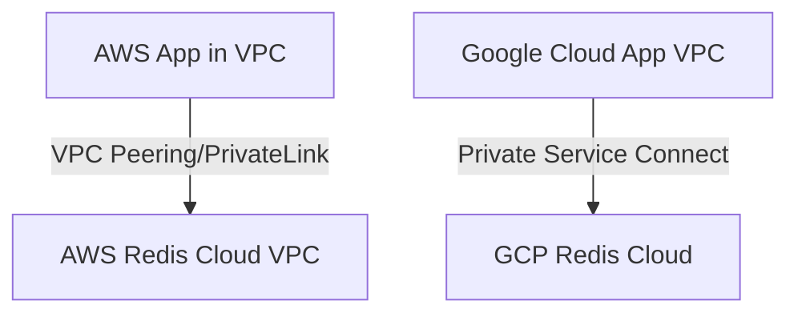

# Redis Cloud — A Solutions Architect’s Research Report

## Executive Summary

Redis Cloud is a fully managed Database‑as‑a‑Service (DBaaS) from Redis that runs on AWS, Google Cloud, and Microsoft Azure, offering Redis and Redis Stack capabilities with managed operations, scaling, and high availability. [Redis Cloud | Docs](https://redis.io/docs/latest/operate/rc/).  
Service levels range from Essentials (shared cloud, single database) to Pro (dedicated deployment), with SLA tiers of 99.9% (Standard), 99.99% (Multi‑AZ), and 99.999% (Active‑Active), aligning availability choices to application resiliency needs. [Redis Cloud SLA](https://redis.io/legal/redis-cloud-service-level-agreement/).  
Architecturally, Redis Cloud exposes a control plane (APIs/console, provisioning, logging) and a data plane (database clusters, shards, replicas) with options for multi‑tenancy, dedicated capacity, clustering, replication, persistence, private connectivity, TLS, and encryption at rest. [Create & manage subscriptions (API)](https://redis.io/docs/latest/operate/rc/api/examples/manage-subscriptions/), [Create & manage databases (API)](https://redis.io/docs/latest/operate/rc/api/examples/create-database/), [Network security](https://redis.io/docs/latest/operate/rc/security/database-security/network-security/), [TLS](https://redis.io/docs/latest/operate/rc/security/database-security/transport-layer-security/), [Encryption at rest](https://redis.io/docs/latest/operate/rc/security/encryption-at-rest/).  
For architects, key considerations include sizing by dataset and throughput, HA/DR posture (single‑zone, multi‑zone, or Active‑Active), network isolation (VPC/VNet peering, AWS PrivateLink, GCP Private Service Connect), RBAC/ACL governance, observability export, and subscription‑level limits and guardrails. [Size a Redis Cloud database](https://redis.io/docs/latest/operate/rc/databases/configuration/sizing/), [High availability & replication](https://redis.io/docs/latest/operate/rc/databases/configuration/high-availability/), [VPC peering](https://redis.io/docs/latest/operate/rc/security/vpc-peering/), [Private Service Connect](https://redis.io/docs/latest/operate/rc/security/private-service-connect/), [Role‑based access control](https://redis.io/docs/latest/operate/rc/security/access-control/data-access-control/role-based-access-control/), [System logs](https://redis.io/docs/latest/operate/rc/logs-reports/system-logs/), [Create & manage subscriptions (API)](https://redis.io/docs/latest/operate/rc/api/examples/manage-subscriptions/).

---

## Methodology & Sources

This report prioritizes official Redis Cloud documentation (product docs, API examples, security references), legal/SLA pages, and cloud‑provider network integration docs; secondary sources (e.g., reputable vendor blogs) were used only to clarify patterns such as AWS PrivateLink. [Redis Cloud | Docs](https://redis.io/docs/latest/operate/rc/), [Redis Cloud SLA](https://redis.io/legal/redis-cloud-service-level-agreement/), [VPC peering](https://redis.io/docs/latest/operate/rc/security/vpc-peering/), [Enable Private Service Connect](https://redis.io/docs/latest/operate/rc/security/private-service-connect/), [AWS PrivateLink blog](https://aws.amazon.com/blogs/apn/enable-private-connectivity-between-redis-enterprise-cloud-pro-and-your-aws-environment-with-aws-privatelink/).  
Definitions for cloud fundamentals (service and deployment models) are taken from NIST SP 800‑145 and related NIST publications to ensure neutral, widely accepted terminology. [NIST SP 800‑145](https://nvlpubs.nist.gov/nistpubs/legacy/sp/nistspecialpublication800-145.pdf), [NIST SP 500‑322](https://nvlpubs.nist.gov/nistpubs/SpecialPublications/NIST.SP.500-322.pdf).  

---

## Core Section 1 — Cloud Fundamentals

### Overview

Cloud computing is defined by NIST as on‑demand network access to a shared pool of configurable resources with five essential characteristics and three service models (IaaS, PaaS, SaaS) across four deployment models (private, public, community, hybrid). [NIST SP 800‑145](https://nvlpubs.nist.gov/nistpubs/legacy/sp/nistspecialpublication800-145.pdf).  
NIST SP 500‑322 elaborates the categorization process for aligning offerings to SaaS/PaaS/IaaS using the SP 800‑145 definitions. [NIST SP 500‑322](https://nvlpubs.nist.gov/nistpubs/SpecialPublications/NIST.SP.500-322.pdf).  

### Detailed Explanations

**Positioning:** Redis Cloud is a managed database platform (DBaaS) that abstracts infrastructure and platform operations while exposing Redis/Redis Stack data services via a service API and console, aligning closest with PaaS/DBaaS in the NIST model. [Redis Cloud | Docs](https://redis.io/docs/latest/operate/rc/).  
**Consumption models:** Essentials (shared cloud, single DB) vs Pro (dedicated deployments with multiple DBs), with Pro supporting advanced networking and higher SLAs; plan choice drives isolation, HA options, and connectivity. [Redis Pricing overview](https://redis.io/pricing/), [High availability & replication](https://redis.io/docs/latest/operate/rc/databases/configuration/high-availability/).  
**Deployment models:** Redis Cloud databases are provisioned in public cloud regions on AWS, Google Cloud, or Azure, enabling single‑provider or multi‑cloud strategies depending on region and plan availability. [Supported cloud providers & regions](https://redis.io/docs/latest/operate/rc/supported-regions/).  
**Shared responsibility:** Redis, the cloud provider, and the customer share responsibilities for platform, infrastructure, configuration, and data; Redis details these boundaries for Redis Cloud. [Redis Cloud shared responsibility model](https://redis.io/docs/latest/operate/rc/security/shared-responsibility-model/).  

### Applications / Use‑Cases

Typical uses include cache, session store, pub/sub, search and query (with RediSearch), JSON document storage, probabilistic data structures (Bloom), time series, and vector search via Redis Stack modules. [Redis Cloud | Docs](https://redis.io/docs/latest/operate/rc/), [Modules: Search/JSON/Bloom/TimeSeries](https://redis.io/docs/latest/operate/rc/databases/configuration/advanced-capabilities/).  

### Benefits & Limitations

Benefits include managed operations, instant failover, linear scalability, and integration with cloud‑native networks and security controls. [Redis Cloud | Docs](https://redis.io/docs/latest/operate/rc/).  
Limitations are plan‑dependent—for example, not all regions or private connectivity options are available for each plan, and some replication or zone settings are immutable post‑creation. [Supported cloud providers & regions](https://redis.io/docs/latest/operate/rc/supported-regions/), [High availability & replication](https://redis.io/docs/latest/operate/rc/databases/configuration/high-availability/).  

### Comparisons

Versus self‑managed Redis, Redis Cloud eliminates cluster and failover operations at the cost of reduced low‑level control and with plan‑defined constraints. [Redis Cloud | Docs](https://redis.io/docs/latest/operate/rc/).  
Among managed alternatives, AWS ElastiCache advertises a 99.99% availability target for Redis in Multi‑AZ, while Redis Cloud offers 99.99% Multi‑AZ and up to 99.999% in Active‑Active; exact applicability depends on chosen configuration. [ElastiCache 99.99% announcement](https://aws.amazon.com/blogs/database/introducing-99-99-availability-with-amazon-elasticache-for-redis-and-amazon-memorydb-for-redis/), [Redis Cloud SLA](https://redis.io/legal/redis-cloud-service-level-agreement/).  
Google Cloud’s Memorystore for Redis/Cluster has different persistence and SLA characteristics; selection depends on required features like Redis Stack search or cross‑region Active‑Active. [Memorystore overview](https://cloud.google.com/memorystore/docs/redis/memorystore-for-redis-overview), [GCP guidance referencing Redis Enterprise Cloud 99.999% Active‑Active](https://cloud.google.com/compute/docs/redis/deployment-options).  

### Operational Considerations

Governance requires mapping Redis’s shared responsibility areas to your controls for identity, key management, data protection, and network boundaries. [Redis Cloud shared responsibility model](https://redis.io/docs/latest/operate/rc/security/shared-responsibility-model/).  
Cost and performance planning should consider dataset size, replication/Active‑Active memory overhead, and throughput targets (ops/sec), which guide compute and NIC allocation. [Size a Redis Cloud database](https://redis.io/docs/latest/operate/rc/databases/configuration/sizing/).  
Networking options include VPC peering, AWS PrivateLink, and GCP Private Service Connect, each with plan, region, and provider‑specific constraints. [VPC peering](https://redis.io/docs/latest/operate/rc/security/vpc-peering/), [AWS PrivateLink pattern](https://aws.amazon.com/blogs/apn/enable-private-connectivity-between-redis-enterprise-cloud-pro-and-your-aws-environment-with-aws-privatelink/), [Private Service Connect](https://redis.io/docs/latest/operate/rc/security/private-service-connect/).  

---

## Core Section 2 — Redis Cloud Architecture & Deployment

### Overview

Redis Cloud exposes a management control plane (console, REST API, logging/auditing) and data plane (database clusters with shards/replicas), supporting multi‑tenant (Essentials) and dedicated (Pro) deployment modes. [Create & manage subscriptions (API)](https://redis.io/docs/latest/operate/rc/api/examples/manage-subscriptions/), [System logs](https://redis.io/docs/latest/operate/rc/logs-reports/system-logs/), [Redis Pricing overview](https://redis.io/pricing/).  
Databases can be sized by dataset and throughput, with clustering automatically determined by memory/throughput, and with optional replication and Active‑Active for higher resiliency. [Size a Redis Cloud database](https://redis.io/docs/latest/operate/rc/databases/configuration/sizing/), [Clustering configuration](https://redis.io/docs/latest/operate/rc/databases/configuration/clustering/), [High availability & replication](https://redis.io/docs/latest/operate/rc/databases/configuration/high-availability/), [Active‑Active](https://redis.io/docs/latest/operate/rc/databases/configuration/active-active-redis/).  

### Detailed Explanations

**Control plane (console/API):** Subscriptions and databases are provisioned and managed via REST endpoints that accept JSON payloads, returning task IDs for asynchronous operations. [Create & manage subscriptions (API)](https://redis.io/docs/latest/operate/rc/api/examples/manage-subscriptions/), [Create & manage databases (API)](https://redis.io/docs/latest/operate/rc/api/examples/create-database/).  
**Data plane (clusters/shards):** Redis Cloud calculates shard counts from memory and throughput needs; clustered databases are exposed via a single endpoint and do not require a cluster‑aware client. [Clustering configuration](https://redis.io/docs/latest/operate/rc/databases/configuration/clustering/), [Cluster endpoint behavior](https://redis.io/docs/latest/operate/rc/databases/configuration/clustering/).  
**Sharding behavior:** Multi‑key commands require keys to co‑locate on the same slot/shard; hashing policies follow Redis semantics, and Enterprise guidance recommends a single hash tag per key. [Clustering limits (multi‑key)](https://redis.io/docs/latest/operate/rc/databases/configuration/clustering/), [Hashing policy (Software)](https://redis.io/docs/latest/operate/rs/7.8/databases/durability-ha/clustering/).  
**When clustering engages:** Large databases (≥ ~25 GB) use clustering, with management guidance provided for shard behavior and client policies. [Manage databases (mentions clustering ≥25 GB)](https://redis.io/docs/latest/operate/rc/databases/).  
**Persistence:** Redis Cloud can persist data to underlying persistent storage; Redis persistence models include RDB (snapshots) and AOF (append‑only), which are fundamental to durability trade‑offs. [Data persistence (Redis Cloud)](https://redis.io/docs/latest/operate/rc/databases/configuration/data-persistence/), [Redis persistence models (OSS)](https://github.com/redis/redis-doc/blob/master/docs/management/persistence.md).  
**Replication & HA:** Options include none, single‑zone, and multi‑zone replication, with automatic failover and memory overhead considerations; zone settings are selected at subscription creation. [High availability & replication](https://redis.io/docs/latest/operate/rc/databases/configuration/high-availability/).  
**Active‑Active:** Multi‑region, multi‑primary CRDT‑based replication provides highest availability tier (SLA up to 99.999%) for write/write global workloads. [Active‑Active](https://redis.io/docs/latest/operate/rc/databases/configuration/active-active-redis/), [Redis Cloud SLA](https://redis.io/legal/redis-cloud-service-level-agreement/).  

#### Networking & Connectivity

**Public endpoints & TLS:** Redis Cloud supports TLS for in‑transit encryption and can block public endpoints when private connectivity is required. [TLS](https://redis.io/docs/latest/operate/rc/security/database-security/transport-layer-security/), [Block public endpoints](https://redis.io/docs/latest/operate/rc/security/block-public-endpoints/).  
**CIDR restrictions:** Database‑level and VPC‑wide CIDR allow lists restrict access to known networks. [Network security](https://redis.io/docs/latest/operate/rc/security/database-security/network-security/), [CIDR allow list](https://redis.io/docs/latest/operate/rc/security/cidr-whitelist/).  
**Private connectivity:**  
• **AWS:** VPC peering and PrivateLink patterns for private access from your VPC. [VPC peering](https://redis.io/docs/latest/operate/rc/security/vpc-peering/), [AWS PrivateLink blog](https://aws.amazon.com/blogs/apn/enable-private-connectivity-between-redis-enterprise-cloud-pro-and-your-aws-environment-with-aws-privatelink/).  
• **GCP:** Private Service Connect creates a private endpoint without exposing your application VPC. [Private Service Connect](https://redis.io/docs/latest/operate/rc/security/private-service-connect/).  
• **Azure:** Plan availability is limited; Redis documents Essentials regions and indicates Pro is available via Azure Cache for Redis Enterprise. [Supported cloud providers & regions](https://redis.io/docs/latest/operate/rc/supported-regions/).  

#### Security Posture

**Encryption at rest:** Redis encrypts data stored on disk for Redis Cloud databases. [Encryption at rest](https://redis.io/docs/latest/operate/rc/security/encryption-at-rest/).  
**Authentication & authorization:** TLS for channel protection; RBAC/ACLs for data access control with a documented subset of ACL commands available in Redis Cloud’s RBAC model. [TLS](https://redis.io/docs/latest/operate/rc/security/database-security/transport-layer-security/), [RBAC](https://redis.io/docs/latest/operate/rc/security/access-control/data-access-control/role-based-access-control/), [Configure ACLs](https://redis.io/docs/latest/operate/rc/security/access-control/data-access-control/configure-acls/).  
**Shared responsibility:** Redis details provider/Redis/customer responsibilities for security and operations. [Shared responsibility model](https://redis.io/docs/latest/operate/rc/security/shared-responsibility-model/).  

#### Observability & Audit

Redis Cloud provides database metrics charts in the console and supports exporting observability to tools like Datadog; system logs capture account‑level changes and can be exported or queried via API. [Monitor database performance](https://redis.io/docs/latest/operate/rc/databases/monitor-performance/), [Datadog integration](https://redis.io/docs/latest/integrate/datadog-with-redis-cloud/), [System logs](https://redis.io/docs/latest/operate/rc/logs-reports/system-logs/), [Audit via API examples](https://redis.io/docs/latest/operate/rc/api/examples/audit-system-logs/).  

#### Backup / Restore / DR

Redis Cloud supports backups/exports and import workflows through the console and API, enabling recovery and migration patterns as part of DR plans. [Back up & export (databases)](https://redis.io/docs/latest/operate/rc/databases/back-up-database-export/), [Database backup & import (API examples)](https://redis.io/docs/latest/operate/rc/api/examples/database-backup-import/).  

#### SLAs

Availability commitments are tied to the chosen redundancy model: Standard 99.9%, Multi‑AZ 99.99%, and Active‑Active 99.999% monthly uptime percentage, with service credits defined by the SLA. [Redis Cloud SLA](https://redis.io/legal/redis-cloud-service-level-agreement/).  

### Applications / Use‑Cases

Cache/session storage, pub/sub, durable primary data with persistence/replication, search & query over JSON documents, time series analytics, and vector similarity search are enabled via the base engine plus Redis Stack modules. [Redis Cloud | Docs](https://redis.io/docs/latest/operate/rc/), [Modules: Search/JSON/Bloom/TimeSeries](https://redis.io/docs/latest/operate/rc/databases/configuration/advanced-capabilities/).  

### Benefits & Limitations

Benefits include single‑endpoint clustered access (no cluster‑aware client needed), plan‑driven HA/DR options, and private connectivity integrations. [Clustering configuration](https://redis.io/docs/latest/operate/rc/databases/configuration/clustering/), [High availability & replication](https://redis.io/docs/latest/operate/rc/databases/configuration/high-availability/), [Network security](https://redis.io/docs/latest/operate/rc/security/database-security/network-security/).  
Limitations include region/plan availability differences, immutable zone settings post‑subscription creation, and memory overhead for replication/Active‑Active. [Supported cloud providers & regions](https://redis.io/docs/latest/operate/rc/supported-regions/), [High availability & replication](https://redis.io/docs/latest/operate/rc/databases/configuration/high-availability/), [Size a Redis Cloud database](https://redis.io/docs/latest/operate/rc/databases/configuration/sizing/).  

### Operational Considerations

**Sizing:** Dataset vs memory limit; replication doubles memory; Active‑Active doubles again (cumulative), and search indexes consume additional memory; throughput (ops/sec) informs compute/network allocation and is not a hard guarantee. [Size a Redis Cloud database](https://redis.io/docs/latest/operate/rc/databases/configuration/sizing/).  
**Clustering/shard growth:** Multi‑key semantics require slot co‑location; plan for hash tags for related keys and recognize shard scaling behavior. [Clustering configuration](https://redis.io/docs/latest/operate/rc/databases/configuration/clustering/), [Hashing policy (Software)](https://redis.io/docs/latest/operate/rs/7.8/databases/durability-ha/clustering/).  
**Networking:** Prefer private connectivity when possible; configure CIDR allow lists and TLS; block public endpoints for sensitive workloads. [VPC peering](https://redis.io/docs/latest/operate/rc/security/vpc-peering/), [Private Service Connect](https://redis.io/docs/latest/operate/rc/security/private-service-connect/), [TLS](https://redis.io/docs/latest/operate/rc/security/database-security/transport-layer-security/), [CIDR allow list](https://redis.io/docs/latest/operate/rc/security/cidr-whitelist/), [Block public endpoints](https://redis.io/docs/latest/operate/rc/security/block-public-endpoints/).  
**Observability & audit:** Use console metrics and integrate Datadog; enable and export system logs and consider API‑based audits. [Monitor database performance](https://redis.io/docs/latest/operate/rc/databases/monitor-performance/), [Datadog integration](https://redis.io/docs/latest/integrate/datadog-with-redis-cloud/), [System logs](https://redis.io/docs/latest/operate/rc/logs-reports/system-logs/), [Audit via API examples](https://redis.io/docs/latest/operate/rc/api/examples/audit-system-logs/).  

---

## Core Section 3 — Hands‑on: Create a Fixed Subscription Redis Cloud Database (UI + API)

### Overview

“Fixed” subscriptions correspond to **Essentials** plans—single database, shared deployment, fixed sizes—created via console or REST endpoints under `/v1/fixed`. [Create & manage subscriptions (API)](https://redis.io/docs/latest/operate/rc/api/examples/manage-subscriptions/), [Create & manage databases (API)](https://redis.io/docs/latest/operate/rc/api/examples/create-database/), [Create an Essentials database (UI)](https://redis.io/docs/latest/operate/rc/databases/create-database/create-essentials-database/).  

### Step‑by‑Step Workflow (Console/UI)

1) **Create subscription + database**: **Sign in → New database → Select “Essentials”**; name the database, choose cloud vendor/region, and plan size; for replication choose no/single‑zone/multi‑zone as supported; confirm creation. [Create an Essentials database (UI)](https://redis.io/docs/latest/operate/rc/databases/create-database/create-essentials-database/), [High availability & replication](https://redis.io/docs/latest/operate/rc/databases/configuration/high-availability/).  
2) **Modules**: Under **Advanced capabilities**, enable modules for Search & Query, JSON, Bloom, and Time Series as required by workload. [Modules: Advanced capabilities](https://redis.io/docs/latest/operate/rc/databases/configuration/advanced-capabilities/).  
3) **Sizing**: Use **Sizing** guidance: dataset vs memory limit, ops/sec throughput, and overhead from replication/Active‑Active; Essentials plan size represents total memory limit. [Size a Redis Cloud database](https://redis.io/docs/latest/operate/rc/databases/configuration/sizing/).  
4) **Networking**: Configure **CIDR allow list** for source IP/subnets; optionally block public endpoint and plan for private connectivity where supported. [CIDR allow list](https://redis.io/docs/latest/operate/rc/security/cidr-whitelist/), [Block public endpoints](https://redis.io/docs/latest/operate/rc/security/block-public-endpoints/), [Network security](https://redis.io/docs/latest/operate/rc/security/database-security/network-security/).  
5) **Security**: Enable **TLS**, create RBAC roles and map users/ACLs to principle of least privilege for the database. [TLS](https://redis.io/docs/latest/operate/rc/security/database-security/transport-layer-security/), [RBAC](https://redis.io/docs/latest/operate/rc/security/access-control/data-access-control/role-based-access-control/), [Configure ACLs](https://redis.io/docs/latest/operate/rc/security/access-control/data-access-control/configure-acls/).  
6) **Persistence**: Select persistence according to plan options and durability goals to back data with persistent storage. [Data persistence (Redis Cloud)](https://redis.io/docs/latest/operate/rc/databases/configuration/data-persistence/).  
7) **Validation**: Use the generated connection info (username/password/URI), verify with `redis-cli` and client libraries, and check the Metrics tab for throughput/latency charts. [Redis Cloud quick start (connect)](https://redis.io/docs/latest/operate/rc/rc-quickstart/), [Monitor database performance](https://redis.io/docs/latest/operate/rc/databases/monitor-performance/).  

### Step‑by‑Step Workflow (API/cURL)

**A. Create an Essentials subscription (Fixed)**  
Use the fixed subscription endpoint with a planId and (if applicable) paymentMethodId; track the asynchronous task. [Create & manage subscriptions (API)](https://redis.io/docs/latest/operate/rc/api/examples/manage-subscriptions/).  

```bash
# Create Essentials (fixed) subscription
curl -sS -X POST "https://api.redislabs.com/v1/fixed/subscriptions" \
  -H "Content-Type: application/json" \
  -H "X-API-KEY: <account_api_key>" \
  -H "X-API-SECRET-KEY: <user_secret_key>" \
  -d '{
        "name": "essentials-subscription-demo",
        "planId": <plan_id>,
        "paymentMethodId": <payment_method_id>
      }'
# Use GET /v1/tasks/{taskId} to poll the task returned by this call.
````

**Notes:** Retrieve valid `planId` values with `GET /v1/fixed/plans` and payment methods with `GET /v1/payment-methods`. [Create & manage subscriptions (API)](https://redis.io/docs/latest/operate/rc/api/examples/manage-subscriptions/).

**B. Create a database inside the fixed subscription**
Use the database endpoint for fixed subscriptions; at minimum supply a name, then add optional settings (modules, persistence) supported by the plan. [Create & manage databases (API)](https://redis.io/docs/latest/operate/rc/api/examples/create-database/), [Modules](https://redis.io/docs/latest/operate/rc/databases/configuration/advanced-capabilities/), [Data persistence](https://redis.io/docs/latest/operate/rc/databases/configuration/data-persistence/).

```bash
# Create a database in an Essentials (fixed) subscription
curl -sS -X POST "https://api.redislabs.com/v1/fixed/subscriptions/<subscriptionId>/databases" \
  -H "Content-Type: application/json" \
  -H "X-API-KEY: <account_api_key>" \
  -H "X-API-SECRET-KEY: <user_secret_key>" \
  -d '{
        "name": "essentials-db-demo"
      }'
# Poll GET /v1/tasks/{taskId} until status is complete; then retrieve DB details.
```

**C. Practical defaults and guardrails**
Pick a region near the app to reduce latency; pick multi‑zone replication only when supported/required; remember replication doubles memory and reduces usable dataset in Essentials; verify throughput needs in Metrics after load testing. [Supported cloud providers & regions](https://redis.io/docs/latest/operate/rc/supported-regions/), [High availability & replication](https://redis.io/docs/latest/operate/rc/databases/configuration/high-availability/), [Size a Redis Cloud database](https://redis.io/docs/latest/operate/rc/databases/configuration/sizing/), [Monitor database performance](https://redis.io/docs/latest/operate/rc/databases/monitor-performance/).

### Validation & Rollback

**Validation:**
• `PING` via `redis-cli` using the provided rediss\:// URI and credentials; confirm module availability with `FT.INFO` (Search) or `JSON.INFO` checks as applicable. [Redis Cloud quick start (connect)](https://redis.io/docs/latest/operate/rc/rc-quickstart/), [Modules: Advanced capabilities](https://redis.io/docs/latest/operate/rc/databases/configuration/advanced-capabilities/).
• Review Metrics graphs for ops/sec, latency, connections; set alerts in Datadog if integrated. [Monitor database performance](https://redis.io/docs/latest/operate/rc/databases/monitor-performance/), [Datadog integration](https://redis.io/docs/latest/integrate/datadog-with-redis-cloud/).

**Rollback:**
• Delete the database or subscription via API (`DELETE /v1/fixed/subscriptions/{id}` or edit to smaller plan where supported) after exporting data/backups as needed. [Create & manage subscriptions (API)](https://redis.io/docs/latest/operate/rc/api/examples/manage-subscriptions/), [Back up & export](https://redis.io/docs/latest/operate/rc/databases/back-up-database-export/).

---

## Technical / Practical Details

### Code Samples — Connect & Basic Ops

> **Sidenote**
> [Link: Redis Cloud quick start](https://redis.io/docs/latest/operate/rc/rc-quickstart/)
> **Command/Concept**: `rediss://` URI → TLS connection string
> **Pattern**: `rediss://<user>:<pass>@<host>:<port>`
> **Result**: Encrypted client–server connection

**redis‑cli (TLS):**

```bash
redis-cli -u "rediss://default:<PASSWORD>@<ENDPOINT_HOST>:<PORT>" PING
```

[Redis Cloud quick start](https://redis.io/docs/latest/operate/rc/rc-quickstart/).

**Node.js (ioredis):**

```js
const Redis = require("ioredis");
const r = new Redis("rediss://default:<PASSWORD>@<ENDPOINT_HOST>:<PORT>");
await r.set("k","v");
console.log(await r.get("k"));
```

[Redis Cloud quick start](https://redis.io/docs/latest/operate/rc/rc-quickstart/).

**Python (redis‑py):**

```python
import redis
r = redis.from_url("rediss://default:<PASSWORD>@<ENDPOINT_HOST>:<PORT>")
r.set("k", "v")
print(r.get("k"))
```

[Redis Cloud quick start](https://redis.io/docs/latest/operate/rc/rc-quickstart/).

**Go (go‑redis):**

```go
package main
import (
  "context"
  "fmt"
  "github.com/redis/go-redis/v9"
)
func main() {
  opt, _ := redis.ParseURL("rediss://default:<PASSWORD>@<ENDPOINT_HOST>:<PORT>")
  rdb := redis.NewClient(opt)
  ctx := context.Background()
  rdb.Set(ctx, "k", "v", 0)
  val, _ := rdb.Get(ctx, "k").Result()
  fmt.Println(val)
}
```

[Redis Cloud quick start](https://redis.io/docs/latest/operate/rc/rc-quickstart/).

### Provisioning & Configuration (API Highlights)

**Essentials (fixed) subscription lifecycle:** `POST /v1/fixed/subscriptions`, `PUT /v1/fixed/subscriptions/{id}`, `DELETE /v1/fixed/subscriptions/{id}`, with `GET /v1/fixed/plans` for eligible plans and `GET /v1/payment-methods` for billing setup. [Create & manage subscriptions (API)](https://redis.io/docs/latest/operate/rc/api/examples/manage-subscriptions/).
**Database lifecycle (fixed):** `POST /v1/fixed/subscriptions/{subscriptionId}/databases`, `PUT /v1/fixed/subscriptions/{subscriptionId}/databases/{databaseId}`; poll `GET /v1/tasks/{taskId}` for operation status. [Create & manage databases (API)](https://redis.io/docs/latest/operate/rc/api/examples/create-database/).
**Audit logs:** `/v1/logs` provides activity audit across account, subscriptions, databases, users, and API keys. [Audit via API examples](https://redis.io/docs/latest/operate/rc/api/examples/audit-system-logs/).

### Diagrams (Mermaid)

**Logical Architecture**

```mermaid
flowchart LR
  subgraph ControlPlane[Redis Cloud Control Plane]
    API[REST API] --- Console[Web Console]
    Logs[System Logs]
  end
  subgraph DataPlane[Redis Cloud Data Plane (Provider Regions)]
    subgraph ClusterA[AWS Region (Pro/Essentials)]
      Shard1[(Primary Shard)]
      Shard2[(Replica Shard)]
    end
    subgraph ClusterB[GCP Region (Pro / Active-Active)]
      A1[(Primary Shard)]
      A2[(Replica Shard)]
    end
  end
  AppVPC[Customer VPC/VNet]--TLS+CIDR-->Endpoint{DB Endpoint}
  Endpoint--routes-->Shard1
  Shard1--replicates-->Shard2
  style Endpoint stroke-dasharray: 5 5
```

[Create & manage subscriptions (API)](https://redis.io/docs/latest/operate/rc/api/examples/manage-subscriptions/), [High availability & replication](https://redis.io/docs/latest/operate/rc/databases/configuration/high-availability/), [Network security](https://redis.io/docs/latest/operate/rc/security/database-security/network-security/).

**Private Connectivity Patterns**



[VPC peering](https://redis.io/docs/latest/operate/rc/security/vpc-peering/), [AWS PrivateLink blog](https://aws.amazon.com/blogs/apn/enable-private-connectivity-between-redis-enterprise-cloud-pro-and-your-aws-environment-with-aws-privatelink/), [Private Service Connect](https://redis.io/docs/latest/operate/rc/security/private-service-connect/).

### Side Notes

> **Sidenote**
> [Link: NIST SP 800‑145](https://nvlpubs.nist.gov/nistpubs/legacy/sp/nistspecialpublication800-145.pdf)
> **Command/Concept**: Cloud models → characteristics/service/deployment models
> **Pattern**: IaaS/PaaS/SaaS + public/private/hybrid
> **Result**: Canonical terminology for architectural mapping

> **Sidenote**
> [Link: Sizing guide](https://redis.io/docs/latest/operate/rc/databases/configuration/sizing/)
> **Command/Concept**: `Throughput (ops/sec)` → capacity guide
> **Pattern**: Set target ops/sec; performance may vary with payloads and commands
> **Result**: Right‑size CPU/NIC and shard count assumptions

> **Sidenote**
> [Link: HA & replication](https://redis.io/docs/latest/operate/rc/databases/configuration/high-availability/)
> **Command/Concept**: `multi-zone replication` → automatic failover
> **Pattern**: Primary/replica placed across zones
> **Result**: Higher resilience and SLA alignment

---

## Comparative Analysis

**Self‑managed Redis (IaaS):** Maximum control and custom topology but full lifecycle burden (patching, failover, persistence ops); Redis Cloud trades control for managed SLAs and rapid provisioning. [Redis Cloud | Docs](https://redis.io/docs/latest/operate/rc/), [NIST SP 800‑145](https://nvlpubs.nist.gov/nistpubs/legacy/sp/nistspecialpublication800-145.pdf).
**AWS ElastiCache for Redis:** AWS‑native service with Multi‑AZ SLA of 99.99% as announced, integrated IAM/VPCs; Redis Cloud can exceed with 99.999% Active‑Active where available, plus Redis Stack features. [ElastiCache 99.99% announcement](https://aws.amazon.com/blogs/database/introducing-99-99-availability-with-amazon-elasticache-for-redis-and-amazon-memorydb-for-redis/), [Redis Cloud SLA](https://redis.io/legal/redis-cloud-service-level-agreement/), [Modules](https://redis.io/docs/latest/operate/rc/databases/configuration/advanced-capabilities/).
**Google Cloud Memorystore:** Different persistence model defaults and feature set; evaluate requirements like RDB/AOF preferences, search, or global write/write. [Memorystore overview](https://cloud.google.com/memorystore/docs/redis/memorystore-for-redis-overview).
**Azure:** Redis Cloud Essentials is limited to specific Azure regions with Pro availability via Azure’s managed Redis Enterprise offer, affecting how you consume Redis enterprise features in Azure. [Supported cloud providers & regions](https://redis.io/docs/latest/operate/rc/supported-regions/).

**Cost/Performance Considerations:** Plan for replication/Active‑Active memory overhead, search index size, and request sizes; throughput is a planning input rather than a hard guarantee, requiring benchmarking and monitoring. [Size a Redis Cloud database](https://redis.io/docs/latest/operate/rc/databases/configuration/sizing/), [Monitor database performance](https://redis.io/docs/latest/operate/rc/databases/monitor-performance/).

---

## Conclusion

Redis Cloud provides a managed Redis/Redis‑Stack platform across major public clouds with configurable durability and availability (up to 99.999% in Active‑Active), private connectivity patterns, and strong security controls, making it suitable for both cache and primary data workloads when sized and governed correctly. [Redis Cloud | Docs](https://redis.io/docs/latest/operate/rc/), [Redis Cloud SLA](https://redis.io/legal/redis-cloud-service-level-agreement/), [Private connectivity docs](https://redis.io/docs/latest/operate/rc/security/vpc-peering/).
For solutions architects, the key is mapping workload SLAs and data durability needs to subscription type, replication/Active‑Active, network isolation, and module choices, then validating assumptions with benchmarks and exported telemetry. [High availability & replication](https://redis.io/docs/latest/operate/rc/databases/configuration/high-availability/), [Modules](https://redis.io/docs/latest/operate/rc/databases/configuration/advanced-capabilities/), [Monitor database performance](https://redis.io/docs/latest/operate/rc/databases/monitor-performance/).

---

## Sources

* [Redis Cloud | Docs](https://redis.io/docs/latest/operate/rc/)
* [Create & manage subscriptions (API)](https://redis.io/docs/latest/operate/rc/api/examples/manage-subscriptions/)
* [Create & manage databases (API)](https://redis.io/docs/latest/operate/rc/api/examples/create-database/)
* [Create an Essentials database (UI)](https://redis.io/docs/latest/operate/rc/databases/create-database/create-essentials-database/)
* [Redis Cloud SLA](https://redis.io/legal/redis-cloud-service-level-agreement/)
* [Supported cloud providers & regions](https://redis.io/docs/latest/operate/rc/supported-regions/)
* [Size a Redis Cloud database](https://redis.io/docs/latest/operate/rc/databases/configuration/sizing/)
* [High availability & replication](https://redis.io/docs/latest/operate/rc/databases/configuration/high-availability/)
* [Active‑Active Redis](https://redis.io/docs/latest/operate/rc/databases/configuration/active-active-redis/)
* [Clustering configuration](https://redis.io/docs/latest/operate/rc/databases/configuration/clustering/)
* [Hashing policy (Redis Software)](https://redis.io/docs/latest/operate/rs/7.8/databases/durability-ha/clustering/)
* [Network security (CIDR/VPC)](https://redis.io/docs/latest/operate/rc/security/database-security/network-security/)
* [VPC peering](https://redis.io/docs/latest/operate/rc/security/vpc-peering/)
* [Enable Private Service Connect (GCP)](https://redis.io/docs/latest/operate/rc/security/private-service-connect/)
* [AWS PrivateLink pattern (blog)](https://aws.amazon.com/blogs/apn/enable-private-connectivity-between-redis-enterprise-cloud-pro-and-your-aws-environment-with-aws-privatelink/)
* [TLS (in transit)](https://redis.io/docs/latest/operate/rc/security/database-security/transport-layer-security/)
* [Encryption at rest](https://redis.io/docs/latest/operate/rc/security/encryption-at-rest/)
* [Block public endpoints](https://redis.io/docs/latest/operate/rc/security/block-public-endpoints/)
* [RBAC](https://redis.io/docs/latest/operate/rc/security/access-control/data-access-control/role-based-access-control/)
* [Configure ACLs](https://redis.io/docs/latest/operate/rc/security/access-control/data-access-control/configure-acls/)
* [Monitor database performance](https://redis.io/docs/latest/operate/rc/databases/monitor-performance/)
* [System logs](https://redis.io/docs/latest/operate/rc/logs-reports/system-logs/)
* [Audit using System Log (API)](https://redis.io/docs/latest/operate/rc/api/examples/audit-system-logs/)
* [Back up & export (databases)](https://redis.io/docs/latest/operate/rc/databases/back-up-database-export/)
* [Database backup & import (API)](https://redis.io/docs/latest/operate/rc/api/examples/database-backup-import/)
* [Modules: Advanced capabilities (Search/JSON/Bloom/TimeSeries)](https://redis.io/docs/latest/operate/rc/databases/configuration/advanced-capabilities/)
* [Redis Pricing overview (shared vs dedicated)](https://redis.io/pricing/)
* [ElastiCache 99.99% announcement](https://aws.amazon.com/blogs/database/introducing-99-99-availability-with-amazon-elasticache-for-redis-and-amazon-memorydb-for-redis/)
* [Memorystore for Redis overview](https://cloud.google.com/memorystore/docs/redis/memorystore-for-redis-overview)
* [GCP: Deployment options referencing Redis Enterprise Cloud 99.999% Active‑Active](https://cloud.google.com/compute/docs/redis/deployment-options)
* [NIST SP 800‑145 — The NIST Definition of Cloud Computing](https://nvlpubs.nist.gov/nistpubs/legacy/sp/nistspecialpublication800-145.pdf)
* [NIST SP 500‑322 — Evaluation of Cloud Computing Services Based on NIST SP 800‑145](https://nvlpubs.nist.gov/nistpubs/SpecialPublications/NIST.SP.500-322.pdf)
* [Redis persistence (OSS reference)](https://github.com/redis/redis-doc/blob/master/docs/management/persistence.md)